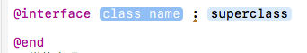
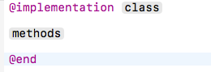

<hr>
## 一、语法简介 ##

### 1.类 ###
在OC中，一般用2个文件来描述一个类：

* <font color="red">.h</font>：类的<font color="red">声明</font>文件，用于声明成员变量、方法。类的声明使用关键字<font color="red">@interface和@end。</font>

注意：.h中的方法只是做一个声明，并不对方法进行实现。也就是说，只是说明一下方法名、方法的返回值类型、方法接收的参数类型而已，并不会编写方法内部的代码。

* <font color="red">.m</font>：类的<font color="red">实现</font>文件，用于实现.h中声明的方法。类的实现使用关键字<font color="red">@implementation和@end</font>。


### 2.方法 ###

1> 方法的声明和实现，都必须以 <font color="red">+ 或者 <font color="red">- 开头

* <font color="red"> ** + **</font>表示<font color="red">类</font>方法(<font color="red">静态</font>方法)
* <font color="red">** - **</font>表示<font color="red">对象</font>方法(<font color="red">动态</font>方法)

2> 在.h中声明的所有方法作用域都是public类型，不能更改


### 3.成员变量 ###

成员变量的常用作用域有3种：

* @<font color="red">public</font> 全局都可以访问
* @<font color="red">protected</font> 只能在类内部和子类中访问
* @<font color="red">private</font> 只能在类内部访问

<hr>
## 二、创建对象 ##
由于OC程序的入口点是main函数，所以在main.m文件中演示Student类的使用。
先上完整代码

```obj-c
#import <Foundation/Foundation.h>
#import "Student.h"

int main(int argc, const char * argv[])
{
   @autoreleasepool {
        Student *stu = [[Student alloc] init];

         [stu release];
     }
     return 0;
}
```
### 1.包含Student.h ###

因为要用到Student这个类，所以在第2行包含了它的头文件

> #import "Student.h"

### 2.创建对象 ###

1> 在Java中是使用关键字new来创建对象，比如new Student()，其实这句代码做了2件事：
* 给对象分配存储空间
* 调用Student的构造方法进行初始化

2> 在OC中创建对象也需要按顺序做上面所述的2件事

1)调用Student类的静态方法alloc分配存储空间

> Student *stu = [Student <font color="blue">alloc<font>];

* OC是方法调用是用中括号[ ]，方法调用者写在括号左侧，方法名写在括号右侧，中间留点空格。因此上面是调用了Student类的静态方法alloc。
* 上面调用的alloc方法会返回分配好内存的Student对象，在等号左边用了一个指向Student类型的<font color="blue">指针变量</font>stu来接收这个对象，注意stu左边的<font color="red">*</font>号。所有OC对象都是用指针变量来接收的，如果你不了解指针，你记住下面这点就行了：利用类名定义一个变量时，类名后面一定要带个<font color="red">*</font>号。
* alloc方法是这样声明的：

> +(<font color="blue">id<font>)alloc;

可以看到，它的返回值类型是id，这个id代表任何指针类型，你可以暂时理解为：id可以代表<font color="red">任何OC对象</font>，类似于NSObject *。


2)调用Student对象的构造方法init进行初始化

前面调用alloc方法返回的Student对象stu是不能正常使用的，因为仅仅是分配了内存，并没有进行初始化，接下来调用对象的init方法进行初始化

> stu = [stu <font color="blue">init<font>];

看清楚了，由于init是动态方法，所以这里使用stu变量来调用，并不是使用类名来调用。init会返回已经初始化完毕的对象，再次赋值给了stu变量。这时候的Student对象stu才能正常使用。


3)其实，我们最常见的做法是将alloc和init连起来使用：

> Student *stu = [[Student <font color="blue">alloc] init<font>];

相信有面向对象开发经验的你一眼就能看懂了，在main.m完整代码的第7行。


<hr>
## 三、代码解析 ##

### 1、如何编写类的声明 ###

* 以<font color="red">@interface </font>开头，以<font color="red">@end</font>结尾，然后再用<font color="red">class name</font>对应的地方写上事物名称，也就是类名即可
<font color="red">注意</font>：类名的首字符必须大写
 声明一个类的目的就是为了告诉系统，我们这个类中有哪些属性和行为

* OC类声明中属性只能写在<font color="red">@interface</font> 和<font color="red">@end</font>之间的<font color="red">{}</font>中,
<font color="red">注意</font>：编写oc类属性的时候，建议将所有属性的名称前面加上<font color="red">** _ **</font>

```obj-c
@interface Iphone :NSObject
{
    //注意：默认情况下，OC对象中属性是不能直接访问的
    @public
    //只要让类中的属性公开，以后就可以直接通过一个指向结构体的指针来操作对象中的属性

    float _model;
    int _cpu;
    double _size;
    int _color;
}
@end
```
* 看第1行，OC中使用关键字@interface来声明一个类，@interface后面紧跟着类名Iphone。
* 类名Student后面的冒号":"表示继承，即第1行代码的意思是Iphone继承自NSObject。
* 第7~10行默认作用域是<font color="red">@protected</font>，即可以在IPhone类内部和子类中访问
* 类的成员变量必须写在大括号{ }里面

### 2、如何编写类的实现 ###
 以<font color="red">@implementation</font>开头，以<font color="red">@end</font>结尾，然后在class对应的地方写上声明时声明的类的名称，必须和声明的类名一模一样



```obj-c
@implementation Iphone
//类的实现,类名必须跟声明时的类名一样
- (int)_cpu {
   // 直接返回成员变量_cpu
     return _cpu;
}
@end
```

### 3、如何通过一个类来创建对象 ###
在oc中想要通过一个类来创建一个对象必须给类发送有个消息（好比c语言中调用方法一样）。而OC中是如何发送消息？

* 在oc中只要想要发送消息就先写上 <font color="red">[类名称/对象名称 方法名称]</font>；
* 发送什么消息（调用什么方法）可以创建一个对象 <font color="red">new</font>

只要通过有个类调用类的<font color="red">new</font>方法，也就是给类发送一个叫做<font color="red">new</font>的消息后，系统内部就会做3件事情：
* 为IPhone类创建出来的对象分配存储空间
* 初始化IPhone类创建出来的对象中的属性
* 返回IPhone类创建出来的对象对应的地址

```obj-c
    Iphone *p =  [Iphone new];
    p->_color = 0;
    p->_cpu = 64;
    return 0;
```

* 通过一个IPhone类型的<font color="red">指针</font>接收了IPhone对象的<font color="red">地址</font>
* 如果使用给一个指针保存了某一个对象的地址，那么我们就称这个指针位之为某个类型的对应的对象
* 利用IPhone类型的指针保存了IPhone对象的地址，那么我们就称IPhone类型的指针p之为IPhone的对象

<font color="red">** OC中的类其实本质就是一个结构体，所以p这个指针其实指向了一个结构体 **</font>
