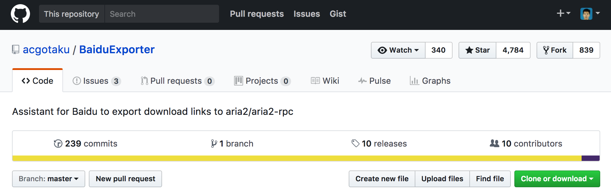

## Mac 百度云加速下载，突破限速，大文件无压力（小白使用无压力） ##

相信使用mac的同学们在使用百度云下载本站软件时肯定碰到过很多问题吧，尤其是大文件。最主要的是Mac端的同步盘太难用了，而且好像已经被官方抛弃了一样，很久都没有更新了。直接浏览器下载吧～限速不说，碰到大文件了还会断开，真是让人又气有无奈。

话不多说，有了这个新方法，虽然可以完全抛弃windows版的百度云了，但是要是照顾一下Windows用户的。这里分享一个windows上的百度云管家[提速破解版] [1] 密码: 2nru。

接下来直奔Mac的主题。傻瓜安装法（更适合小白同学）
* 1、先下载[Aria2GUI dmg] [2]，解压并安装。
下载好后安装：每次下载东西的时候都需要打开这个Aria2GUI客户端
* 2、[网盘助手] [3]
插件目前只有chrome版本在一直维护，所以，只适用于chrome浏览器，按照以下方法，安装完了以后，在百度云的下载界面会多出来一个 “导出下载”的按钮，点击这个里面的"ARIA2 RPC"，下载任务会自动在Aria2GUI客户端中开始

目前百度云插件已停止打包，使用最新版本方法如下：

下载[百度云插件源代码] [4] 并解压，如图

直接将 下载好的文件夹中的 chrome.crx 文件拖动到浏览器的 扩展程序 界面进行安装。

安装完毕后请参考：[mac折腾手记（二）--- 将非官方扩展程序加入chrome的白名单] [5] 解决扩展程序失效停用的问题

[1]: https://pan.baidu.com/s/1hsl4fMO 密码: 2nru
[2]: https://github.com/yangshun1029/aria2gui/releases
[3]: https://github.com/acgotaku/BaiduExporter/releases
[4]: https://github.com/acgotaku/BaiduExporter
[5]
