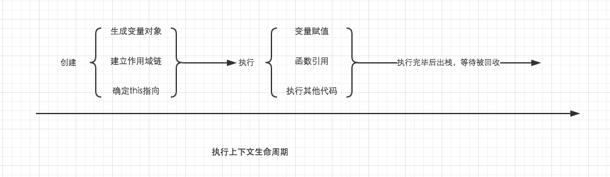
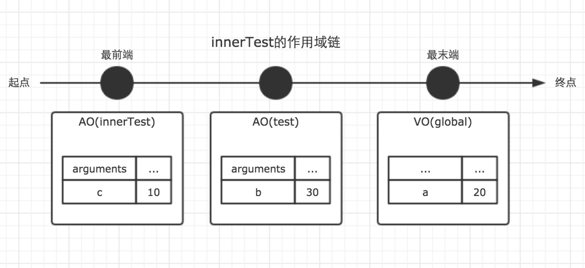

<center>本文源出于---简书[**波同学**] [1]</center>

<hr>
## 一、作用域与作用域链 ##

在详细讲解作用域链之前，我默认你已经大概明白了JavaScript中的下面这些重要概念。这些概念将会非常有帮助。

* 基础数据类型与引用数据类型
* 内存空间
* 垃圾回收机制
* 执行上下文
* 变量对象与活动对象


#### 作用域 ####

在JavaScript中，我们可以将作用域定义为一套规则,这套规则用来管理引擎如何在当前作用域以及嵌套的子作用域中根据标识符名称进行变量查找。

> 这里的标识符，指的是变量名或者函数名

* JavaScript中只有全局作用域与函数作用域(因为eval我们平时开发中几乎不会用到它，这里不讨论)。
* 作用域与执行上下文是完全不同的两个概念。我知道很多人会混淆他们，但是一定要仔细区分。

> JavaScript代码的整个执行过程，分为两个阶段，代码编译阶段与代码执行阶段。编译阶段由编译器完成，将代码翻译成可执行代码，这个阶段作用域规则会确定。执行阶段由引擎完成，主要任务是执行可执行代码，执行上下文在这个阶段创建。


#### 作用域链 ####

之前我们分析的执行上下文的生命周期，如下图。



我们发现，作用域链是在执行上下文的创建阶段生成的。这个就奇怪了。上面我们刚刚说作用域在编译阶段确定规则，可是为什么作用域链却在执行阶段确定呢？

之所以有这个疑问，是因为大家对作用域和作用域链有一个误解。我们上面说了，作用域是一套规则，那么作用域链是什么呢？是这套规则的具体实现。所以这就是作用域与作用域链的关系，相信大家都应该明白了吧。

我们知道函数在调用激活时，会开始创建对应的执行上下文，在执行上下文生成的过程中，变量对象，作用域链，以及this的值会分别被确定。之前们详细说明了变量对象，而这里，我们将详细说明作用域链。

** 作用域链，是由当前环境与上层环境的一系列变量对象组成，它保证了当前执行环境对符合访问权限的变量和函数的有序访问。 **

为了帮助大家理解作用域链，我我们先结合一个例子，以及相应的图示来说明。

``` JavaScript
var a = 20;

function test() {
    var b = a + 10;

    function innerTest() {
        var c = 10;
        return b + c;
    }

    return innerTest();
}

test();
```
在上面的例子中，全局，函数test，函数innerTest的执行上下文先后创建。我们设定他们的变量对象分别为VO(global)，VO(test), VO(innerTest)。而innerTest的作用域链，则同时包含了这三个变量对象，所以innerTest的执行上下文可如下表示。
``` JavaScript
innerTestEC = {
    VO: {...},  // 变量对象
    scopeChain: [VO(innerTest), VO(test), VO(global)], // 作用域链
    this: {}
}
```
是的，你没有看错，我们可以直接用一个数组来表示作用域链，数组的第一项scopeChain[0]为作用域链的最前端，而数组的最后一项，为作用域链的最末端，所有的最末端都为全局变量对象。

很多人会误解为当前作用域与上层作用域为包含关系，但其实并不是。以最前端为起点，最末端为终点的单方向通道我认为是更加贴切的形容。如图。



> 注意，因为变量对象在执行上下文进入执行阶段时，就变成了活动对象，这一点在上一篇文章中已经讲过，因此图中使用了AO来表示。Active Object

是的，作用域链是由一系列变量对象组成，我们可以在这个单向通道中，查询变量对象中的标识符，这样就可以访问到上一层作用域中的变量了。
<hr>

## 二、闭包 ##

对于那些有一点 JavaScript 使用经验但从未真正理解闭包概念的人来说，理解闭包可以看作是某种意义上的重生，突破闭包的瓶颈可以使你功力大增。

* 闭包与作用域链息息相关；
* 闭包是在函数执行过程中被确认。

先直截了当的抛出闭包的定义：<font color="red">当函数可以记住并访问所在的作用域(全局作用域除外)时，就产生了闭包，即使函数是在当前作用域之外执行。</font>

> 简单来说，假设函数A在函数B的内部进行定义了，并且当函数A在执行时，访问了函数B内部的变量对象，那么B就是一个闭包

JavaScript的垃圾回收机制。JavaScript拥有自动的垃圾回收机制，关于垃圾回收机制，有一个重要的行为，那就是，当一个值，在内存中失去引用时，垃圾回收机制会根据特殊的算法找到它，并将其回收，释放内存。

而我们知道，函数的执行上下文，在执行完毕之后，生命周期结束，那么该函数的执行上下文就会失去引用。其占用的内存空间很快就会被垃圾回收器释放。可是闭包的存在，会阻止这一过程。

先来一个简单的例子。
``` JavaScript
var fn = null;
function foo() {
    var a = 2;
    function innnerFoo() {
        console.log(a);
    }
    fn = innnerFoo; // 将 innnerFoo的引用，赋值给全局变量中的fn
}

function bar() {
    fn(); // 此处的保留的innerFoo的引用
}

foo();
bar(); // 2
```

在上面的例子中，foo()执行完毕之后，按照常理，其执行环境生命周期会结束，所占内存被垃圾收集器释放。但是通过fn = innerFoo，函数innerFoo的引用被保留了下来，复制给了全局变量fn。这个行为，导致了foo的变量对象，也被保留了下来。于是，函数fn在函数bar内部执行时，依然可以访问这个被保留下来的变量对象。所以此刻仍然能够访问到变量a的值。

这样，我们就可以称foo为闭包。

下图展示了闭包foo的作用域链。


我们可以在chrome浏览器的开发者工具中查看这段代码运行时产生的函数调用栈与作用域链的生成情况。如下图。


在上面的图中，红色箭头所指的正是闭包。其中Call Stack为当前的函数调用栈，Scope为当前正在被执行的函数的作用域链，Local为当前的局部变量。

<font color="red">所以，通过闭包，我们可以在其他的执行上下文中，访问到函数的内部变量。</font>比如在上面的例子中，我们在函数bar的执行环境中访问到了函数foo的a变量。个人认为，从应用层面，这是闭包最重要的特性。利用这个特性，我们可以实现很多有意思的东西。

不过读者老爷们需要注意的是，虽然例子中的闭包被保存在了全局变量中，但是闭包的作用域链并不会发生任何改变。在闭包中，能访问到的变量，仍然是作用域链上能够查询到的变量。

对上面的例子稍作修改，如果我们在函数bar中声明一个变量c，并在闭包fn中试图访问该变量，运行结果会抛出错误。
``` JavaScript
var fn = null;
function foo() {
    var a = 2;
    function innnerFoo() {
        console.log(c); // 在这里，试图访问函数bar中的c变量，会抛出错误
        console.log(a);
    }
    fn = innnerFoo; // 将 innnerFoo的引用，赋值给全局变量中的fn
}

function bar() {
    var c = 100;
    fn(); // 此处的保留的innerFoo的引用
}

foo();
bar();
```

#### 闭包的应用场景 ####

接下来，我们来总结下，闭包的常用场景。

延迟函数setTimeout
我们知道setTimeout的第一个参数是一个函数，第二个参数则是延迟的时间。在下面例子中，

```JavaScript
function fn() {
    console.log('this is test.')
}
var timer =  setTimeout(fn, 1000);
console.log(timer);
```
执行上面的代码，变量timer的值，会立即输出出来，表示setTimeout这个函数本身已经执行完毕了。但是一秒钟之后，fn才会被执行。这是为什么？

按道理来说，既然fn被作为参数传入了setTimeout中，那么fn将会被保存在setTimeout变量对象中，setTimeout执行完毕之后，它的变量对象也就不存在了。可是事实上并不是这样。至少在这一秒钟的事件里，它仍然是存在的。这正是因为闭包。

很显然，这是在函数的内部实现中，setTimeout通过特殊的方式，保留了fn的引用，让setTimeout的变量对象，并没有在其执行完毕后被垃圾收集器回收。因此setTimeout执行结束后一秒，我们任然能够执行fn函数。

* **柯里化**
在函数式编程中，利用闭包能够实现很多炫酷的功能，柯里化算是其中一种。关于柯里化，我会在以后详解函数式编程的时候仔细总结。

* **模块**
在我看来，模块是闭包最强大的一个应用场景。如果你是初学者，对于模块的了解可以暂时不用放在心上，因为理解模块需要更多的基础知识。但是如果你已经有了很多JavaScript的使用经验，在彻底了解了闭包之后，不妨借助本文介绍的作用域链与闭包的思路，重新理一理关于模块的知识。这对于我们理解各种各样的设计模式具有莫大的帮助。
```JavaScript
(function () {
    var a = 10;
    var b = 20;

    function add(num1, num2) {
        var num1 = !!num1 ? num1 : a;
        var num2 = !!num2 ? num2 : b;

        return num1 + num2;
    }

    window.add = add;
})();

add(10, 20);
```
在上面的例子中，我使用函数自执行的方式，创建了一个模块。add是模块对外暴露的一个公共方法。而变量a，b被作为私有变量。在面向对象的开发中，我们常常需要考虑是将变量作为私有变量，还是放在构造函数中的this中，因此理解闭包，以及原型链是一个非常重要的事情。


为了验证自己有没有搞懂作用域链与闭包，这里留下一个经典的思考题，常常也会在面试中被问到。

利用闭包，修改下面的代码，让循环输出的结果依次为1， 2， 3， 4， 5
```JavaScript
for (var i=1; i<=5; i++) {
    setTimeout( function timer() {
        console.log(i);
    }, i*1000 );
}
```
<hr>

___本文仅作为个人的随身读书笔记收集，没有用于任何商业盈利范畴。如若有侵犯源作者的著作权，请联系本人（立马撤文）mstarzheng@foxmail.com___


[1]: http://www.jianshu.com/p/21a16d44f150
