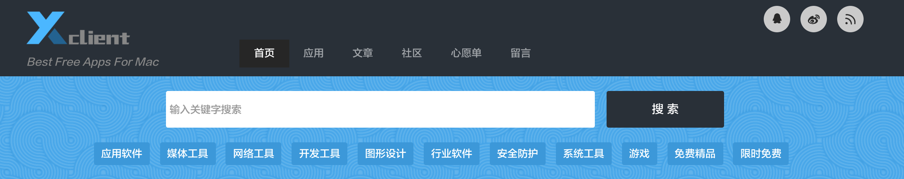
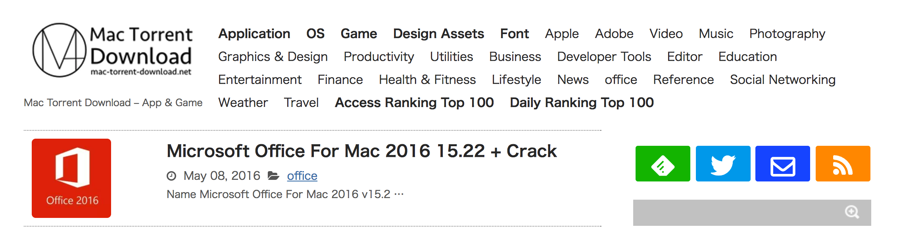
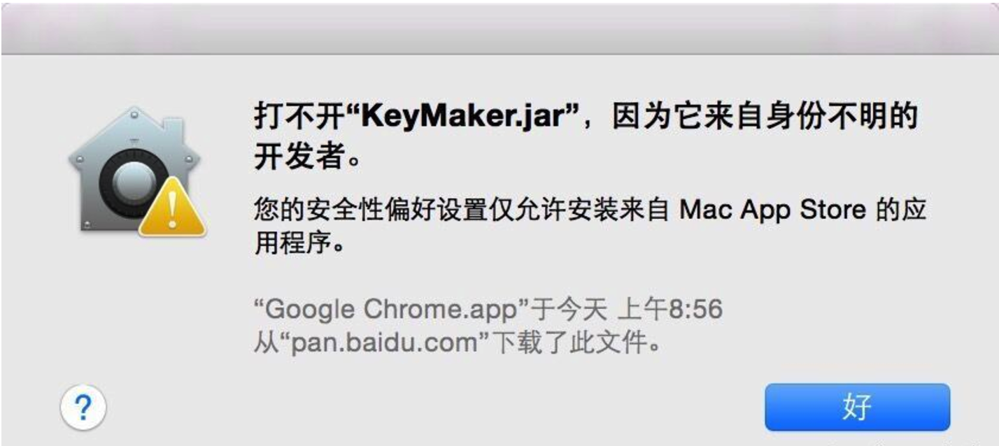
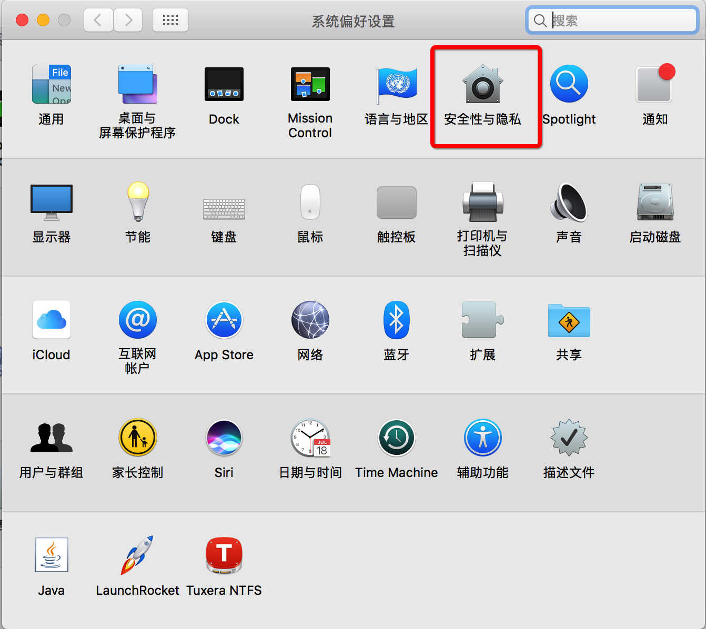
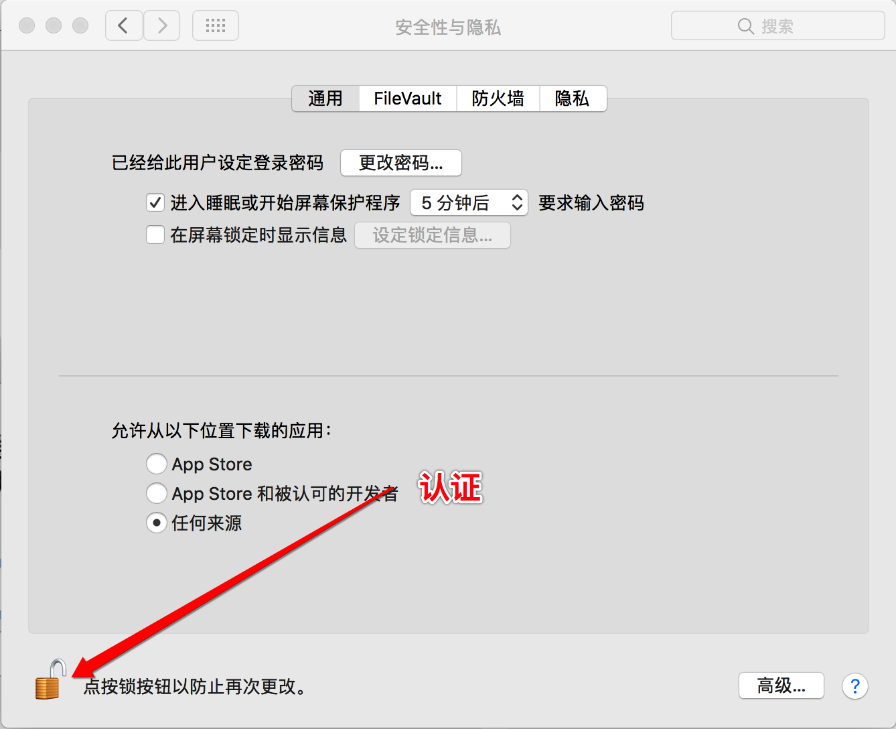
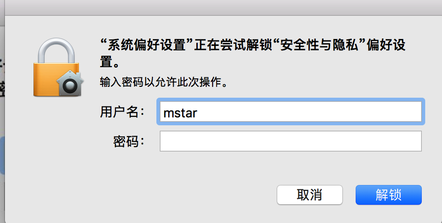
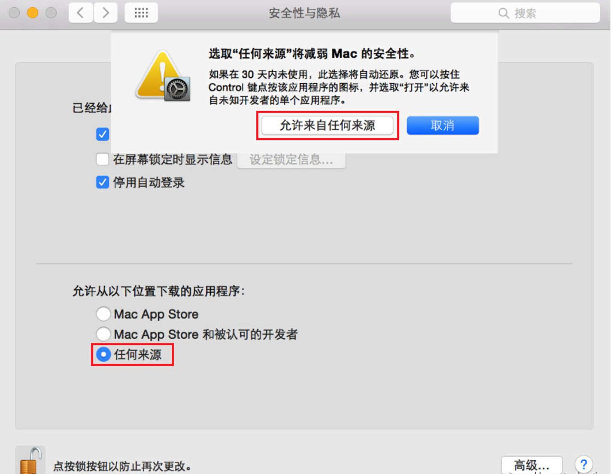

题记：小编之前也是忠实的Windows的使用者，但是自从上手了第一个Mac后，瞬间就爱上了这台电脑，有一种上手恨晚的感觉。但是加上小编之前习惯使用Windows电脑，所以刚上手Mac甚是不习惯，比如好多安装软件都是收费的等。但是试用几天后，感觉甚是爽哉！！！下面呢，小编就带领着大家绕过装逼的这些坑。。。。。。

上来先放两个大招，对于我们在天朝一直使用免费软件的童鞋们，简直是福利呀！！！
* [国内网址] [1] 可以满足大部分人的需求

* [国外网址] [2] 这两简直是宝藏呀（可能需要翻墙，你懂得）

但牛逼的Mac系统总会让你遇到各种问题。
>有些用户下载了一些程序之后，却发现无法在MAC中安装，安装时会弹出下图所示警告框：“打不开 xxx，因为它来自身份不明的开发者”。那么该如何解决这个问题呢？

在MAC下安装一些软件时提示"来自身份不明开发者"，其实这是MAC新系统启用了新的安全机制。
默认只信任 Mac App Store 下载的软件和拥有开发者 ID 签名的应用程序。
换句话说就是 MAC 系统默认只能安装靠谱渠道（有苹果审核的 Mac App Store）下载的软件或被认可的人开发的软件。

这当然是为了用户不会稀里糊涂安装流氓软件中招，但没有开发者签名的 “老实软件” 也受影响了，安装就会弹出下图所示警告框：“打不开 xxx，因为它来自身份不明的开发者”。

出现这个问题的解决方法有2种：

* 1、最简单的方式：按住Control后，再次点击软件图标，即可。
* 2、修改系统配置：系统偏好设置... -> 安全性与隐私。

系统偏好设置

安全性与隐私

认证

修改为任何来源
 ### 高能预警！！！！！！！！(专门为不仔细看文章的准备的。。。。。。。) ### 

> 如果没有这个选项的话（macOS Sierra 10.12）,打开终端，执行sudo spctl --master-disable即可

[1]: http://xclient.info/
[2]: http://mac-torrent-download.net/
