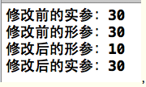
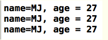

<center>本文源出于---[**小码哥**] [1]</center>
<hr>
## 一、什么是结构体 ##
* 当一个整体由多个数据构成时，我们可以用数组来表示这个整体，但是数组有个特点：内部的每一个元素都必须是相同类型的数据。
* 在实际应用中，我们通常需要由不同类型的数据来构成一个整体，比如学生这个整体可以由姓名、年龄、身高等数据构成，这些数据都具有不同的类型，姓名可以是字符串类型，年龄可以是整型，身高可以是浮点型。
* 为此，C语言专门提供了一种构造类型来解决上述问题，这就是结构体，它允许内部的元素是不同类型的。

## 二、结构体的定义 ##
### 1.定义形式 ###

 结构体内部的元素，也就是组成成分，我们一般称为"成员"。

结构体的一般定义形式为：
```C
struct　结构体名{

    类型名1　成员名1;

    类型名2　成员名2;

    ……

    类型名n　成员名n;　　　

};
```
<font color="blue">struct</font>是关键字，是结构体类型的标志。


### 2.举例 ###

比如，我们定义一个学生
```C
struct Student {
    char *name; // 姓名
    int age; // 年龄
    float height; // 身高
};
```
上面定义了一个叫做Student的结构体，共有name、age、height3个成员。呵呵，看到这里是否有点面向对象的味道呢，其实这跟面向对象完全是两码事，只能说感觉有点像。


## 三、结构体变量的定义 ##

前面只是定义了名字为Student的结构体类型，并非定义了一个结构体变量，就像int一样，只是一种类型。

接下来定义一个结构体变量，方式有好多种。

### 1.先定义结构体类型，再定义变量 ###

```C
 struct Student {
    char *name;
    int age;
 };

struct Student stu;
```

第6行定义了一个结构体变量，变量名为stu。struct和Student是连着使用的。


### 2.定义结构体类型的同时定义变量 ###
```C
struct Student {
    char *name;
    int age;
} stu;
```
结构体变量名为stu


### 3.直接定义结构体类型变量，省略类型名 ###
```C
struct {
    char *name;
    int age;
} stu;
```
结构体变量名为stu


## 四、结构体的注意点 ##

### 1.不允许对结构体本身递归定义 ###

如下做法是<font color="red">错误</font>的，注意第3行
```C
struct Student {
    int age;
    struct Student stu;
 };
```

### 2.结构体内可以包含别的结构体 ###

```C
struct Date {
      int year;
      int month;
      int day;
};

struct Student {
     char *name;
     struct Date birthday;
};
```
注意第9行


### ** 3.定义结构体类型，只是说明了该类型的组成情况，并没有给它分配存储空间，就像系统不为int类型本身分配空间一样。只有当定义属于结构体类型的变量时，系统才会分配存储空间给该变量 ** ###

```C
struct Student {
    char *name;
    int age;
};

struct Student stu;
```
第1~4行并没有分配存储空间，当执行到第6行时，系统才会分配存储空间给stu变量。


### ** 4.结构体变量占用的内存空间是其成员所占内存之和，而且各成员在内存中按定义的顺序依次排列 ** ###

比如下面的Student结构体：
```C
struct Student {
    char *name; // 姓名
    int age; // 年龄
    float height; // 身高
};
```
在16位编译器环境下，一个Student变量共占用内存：2 + 2 + 4 = 8字节。


## 五、结构体的初始化 ##

将各成员的初值，按顺序地放在一对大括号{}中，并用逗号分隔，一一对应赋值。

比如初始化Student结构体变量stu

```C
 struct Student {
    char *name;
    int age;
};

struct Student stu = {"MJ", 27};
```

只能在定义变量的同时进行初始化赋值，初始化赋值和变量的定义不能分开，下面的做法是<font color="red">错误</font>的：
```C
struct Student stu;
stu = {"MJ", 27};
```


## 六、结构体的使用 ##

### ** 1.一般对结构体变量的操作是以成员为单位进行的，引用的一般形式为：结构体变量名.成员名 ** ###

```C
struct Student {
    char *name;
    int age;
 };

 struct Student stu;

// 访问stu的age成员
stu.age = 27;
```
第9行对结构体的age成员进行了赋值。"."称为成员运算符，它在所有运算符中优先级最高


### ** 2.如果某个成员也是结构体变量，可以连续使用成员运算符"."访问最低一级成员 ** ####

```C
struct Date {
        int year;
        int month;
        int day;
 };

struct Student {
        char *name;
        struct Date birthday;
};

struct Student stu;

stu.birthday.year = 1986;
stu.birthday.month = 9;
stu.birthday.day = 10;
```
注意第14行以后的代码


### ** 3.相同类型的结构体变量之间可以进行整体赋值 ** ###

```C
struct Student {
     char *name;
     int age;
};

 struct Student stu1 = {"MJ", 27};

 // 将stu1直接赋值给stu2
 struct Student stu2 = stu1;

 printf("age is %d", stu2.age);
```
注意第9行。输出结果为：#### age is 27 ####


## 七、结构体数组 ##

### 1.定义 ###

跟结构体变量一样，结构体数组也有3种定义方式
```C
struct Student {
    char *name;
    int age;
};
struct Student stu[5]; //定义1
```C

```C
struct Student {
    char *name;
    int age;
} stu[5]; //定义2
```

```
struct {
    char *name;
    int age;
} stu[5]; //定义3
```

上面3种方式，都是定义了一个变量名为stu的结构体数组，数组元素个数是5


### 2.初始化 ###
```C
struct {
    char *name;
    int age;
} stu[2] = { {"MJ", 27}, {"JJ", 30} };
```
也可以用数组下标访问每一个结构体元素，跟普通数组的用法是一样的


## 八、结构体作为函数参数 ##

将结构体变量作为函数参数进行传递时，其实传递的是全部成员的值，也就是将实参中成员的值一一赋值给对应的形参成员。因此，形参的改变不会影响到实参。

```C
#include <stdio.h>

 // 定义一个结构体
 struct Student {
    int age;
 };

 void test(struct Student stu) {
     printf("修改前的形参：%d \n", stu.age);
     // 修改实参中的age
     stu.age = 10;

     printf("修改后的形参：%d \n", stu.age);
}

 int main(int argc, const char * argv[]) {

     struct Student stu = {30};
     printf("修改前的实参：%d \n", stu.age);

    // 调用test函数
     test(stu);


     printf("修改后的实参：%d \n", stu.age);
    return 0;
 }
```
* 首先在第4行定义了一个结构体类型Student

* 在第18行定义了一个结构体变量stu，并在第22行将其作为实参传入到test函数

输出结果为：
形参是改变了，但是实参一直没有变过


## 九、指向结构体的指针 ##

> 每个结构体变量都有自己的存储空间和地址，因此指针也可以指向结构体变量

> 结构体指针变量的定义形式：struct 结构体名称 *指针变量名

> 有了指向结构体的指针，那么就有3种访问结构体成员的方式

* 结构体变量名.成员名
* (*指针变量名).成员名
* 指针变量名->成员名
*
```C
#include <stdio.h>

 int main(int argc, const char * argv[]) {
     // 定义一个结构体类型
     struct Student {
         char *name;
         int age;
     };

     // 定义一个结构体变量
     struct Student stu = {"MJ", 27};

     // 定义一个指向结构体的指针变量
     struct Student *p;

     // 指向结构体变量stu
     p = &stu;

     /*
      这时候可以用3种方式访问结构体的成员
     */
    // 方式1：结构体变量名.成员名
     printf("name=%s, age = %d \n", stu.name, stu.age);

     // 方式2：(*指针变量名).成员名
     printf("name=%s, age = %d \n", (*p).name, (*p).age);

     // 方式3：指针变量名->成员名
     printf("name=%s, age = %d \n", p->name, p->age);

     return 0;
 }

输出结果： 


<hr>
___本文仅作为个人的随身读书笔记收集，没有用于任何商业盈利范畴。如若有侵犯源作者的著作权，请联系本人（立马撤文）mstarzheng@foxmail.com___


[1]: http://www.cnblogs.com/mjios/archive/2013/03/24/2977910.html
