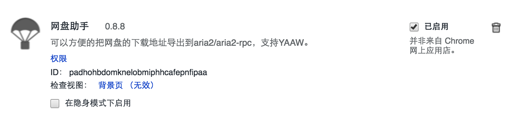
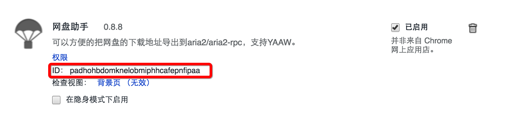
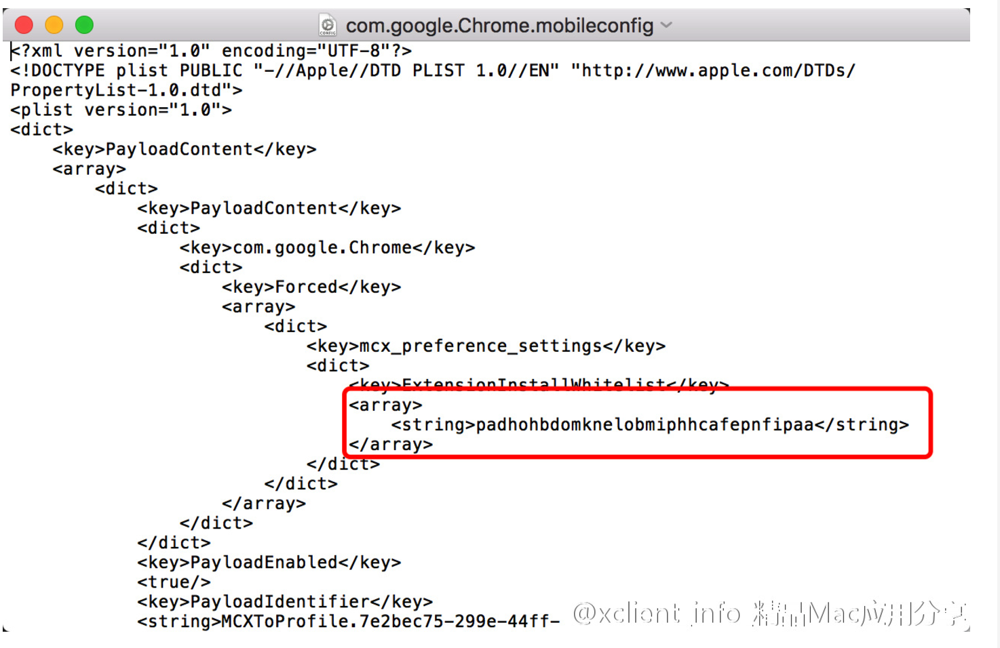

## 将非官方扩展程序加入chrome的白名单 ##
<hr>

> 在chrome中正常使用并非来自 Chrome 网上应用店的扩展,会出现下面的情况：



小编在网上也找到了一些 [英文文档] [1]来解决这类问题。
> <font color="red">注意：该方法只适用于 通过 crx 文件安装的扩展（将crx文件拖入chrome扩展程序界面）</font>

而还有一些类似小编一样英文不好的同学，该怎么办呢？没事你们的福利来了，跟着我一步步来走吧。。。

1、首先下载有个描述文件：[Github地址] [2]
下载不下来的，再提供一个[网盘地址] [3] 密码：dvfx

2、打开 chrome的 <font color="red">扩展程序 </font>界面，复制扩展的ID。


3、用文本编辑器打开下载好的com.google.Chrome.mobileconfig找到如图所示位置：
```HTML
<?xml version="1.0" encoding="UTF-8"?>
<!DOCTYPE plist PUBLIC "-//Apple//DTD PLIST 1.0//EN" "http://www.apple.com/DTDs/PropertyList-1.0.dtd">
<plist version="1.0">
<dict>
    <key>PayloadContent</key>
    <array>
        <dict>
            <key>PayloadContent</key>
            <dict>
                <key>com.google.Chrome</key>
                <dict>
                    <key>Forced</key>
                    <array>
                        <dict>
                            <key>mcx_preference_settings</key>
                            <dict>
                                <key>ExtensionInstallWhitelist</key>
                                <array>
                                    <string>value01</string>
                                    <string>value02</string>
                                    <string>value03</string>
                                </array>
                            </dict>
                        </dict>
                    </array>
                </dict>
            </dict>
            <key>PayloadEnabled</key>
            <true/>
            <key>PayloadIdentifier</key>
            <string>MCXToProfile.7e2bec75-299e-44ff-b405-628007abffff.alacarte.customsettings.bdac4880-d25f-4cdd-8472-05473f005e7e</string>
            <key>PayloadType</key>
            <string>com.apple.ManagedClient.preferences</string>
            <key>PayloadUUID</key>
            <string>bdac4880-d25f-4cdd-8472-05473f005e7e</string>
            <key>PayloadVersion</key>
            <integer>1</integer>
        </dict>
    </array>
    <key>PayloadDescription</key>
    <string>Included custom settings:
com.google.Chrome
</string>
    <key>PayloadDisplayName</key>
    <string>MCXToProfile: com.google.Chrome</string>
    <key>PayloadIdentifier</key>
    <string>com.google.Chrome</string>
    <key>PayloadOrganization</key>
    <string></string>
    <key>PayloadRemovalDisallowed</key>
    <true/>
    <key>PayloadScope</key>
    <string>System</string>
    <key>PayloadType</key>
    <string>Configuration</string>
    <key>PayloadUUID</key>
    <string>7e2bec75-299e-44ff-b405-628007abffff</string>
    <key>PayloadVersion</key>
    <integer>1</integer>
</dict>
</plist>
```
这里的 19-21行 <string></string> 中分别对应单个扩展的ID，如果只需要一个的话，可以吧多余的两个删掉，将其中的一个标签中的值替换为第二步复制过来的 ID。编辑完后保存。如图：



4、双击打开第三步编辑好的描述文件，按照弹出的提示点击 继续-安装（输入电脑密码），安装结束后重启浏览器，就可以勾选这个扩展了，并且以后重启浏览器也不会有停用的提示了！


[1]: https://hencolle.com/2016/10/16/baidu_exporter/
[2]: https://gist.github.com/Explorare/be3dd598289252698cd37bca04abd0fe#file-com-google-chrome-mobileconfig
[3]: https://pan.baidu.com/s/1eRPT11g
