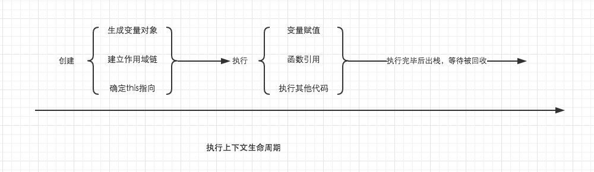

<center>本文源出于---简书[**波同学**] [1]</center>
<hr>
回顾一下执行上下文声明周期


在执行上下文的创建阶段，会分别生成变量对象，建立作用域链，确定this指向。其中变量对象与作用域链我们都已经仔细总结过了，而这里的关键，就是确定this指向。

在这里，我们需要得出一个非常重要一定要牢记于心的结论，** this的指向，是在函数被调用的时候确定的。也就是执行上下文被创建时确定的 **。因此我们可以很容易就能理解到，一个函数中的this指向，可以是非常灵活的。比如下面的例子中，同一个函数由于调用方式的不同，this指向了不一样的对象。
```JavaScript
var a = 10;
var obj = {
    a: 20
}

function fn () {
    console.log(this.a);
}

fn(); // 10
fn.call(obj); // 20
```
除此之外，** 在函数执行过程中，this一旦被确定，就不可更改了 **。
```JavaScript
var a = 10;
var obj = {
    a: 20
}

function fn () {
    this = obj; // 这句话试图修改this，运行后会报错
    console.log(this.a);
}

fn();
```
<hr>


## 一、全局对象中的this ##

关于全局对象的this，我之前在总结变量对象的时候提到过，它是一个比较特殊的存在。全局环境中的this，指向它本身。因此，这也相对简单，没有那么多复杂的情况需要考虑。
```JavaScript
// 通过this绑定到全局对象
this.a2 = 20;

// 通过声明绑定到变量对象，但在全局环境中，变量对象就是它自身
var a1 = 10;

// 仅仅只有赋值操作，标识符会隐式绑定到全局对象
a3 = 30;

// 输出结果会全部符合预期
console.log(a1);
console.log(a2);
console.log(a3);
```
<hr>

## 二、函数中的this ##

在总结函数中this指向之前，我想我们有必要通过一些奇怪的例子，来感受一下函数中this的捉摸不定。

```JavaScript
// demo01
var a = 20;
function fn() {
    console.log(this.a);
}
fn();
```

```JavaScript
// demo02
var a = 20;
function fn() {
    function foo() {
        console.log(this.a);
    }
    foo();
}
fn();
```

```JavaScript
// demo03
var a = 20;
var obj = {
    a: 10,
    c: this.a + 20,
    fn: function () {
        return this.a;
    }
}

console.log(obj.c);
console.log(obj.fn());
```

这几个例子需要读者老爷们花点时间稍微感受一下，如果你暂时没想明白怎么回事，也不用着急，我们一点一点来分析。

分析之前，我们先直接了当抛出结论。

在一个函数上下文中，this由调用者提供，由调用函数的方式来决定。** 如果调用者函数，被某一个对象所拥有，那么该函数在调用时，内部的this指向该对象。如果函数独立调用，那么该函数内部的this，则指向undefined **。但是在非严格模式中，当this指向undefined时，它会被自动指向全局对象。

从结论中我们可以看出，想要准确确定this指向，找到函数的调用者以及区分他是否是独立调用就变得十分关键。

```JavaScript
// 为了能够准确判断，我们在函数内部使用严格模式，因为非严格模式会自动指向全局
function fn() {
    'use strict';
    console.log(this);
}

fn();  // fn是调用者，独立调用
window.fn();  // fn是调用者，被window所拥有
```

在上面的简单例子中，fn()作为独立调用者，按照定义的理解，它内部的this指向就为undefined。而window.fn()则因为fn被window所拥有，内部的this就指向了window对象。

那么掌握了这个规则，现在回过头去看看上面的三个例子，通过添加/去除严格模式，那么你就会发现，原来this已经变得不那么虚无缥缈，已经有迹可循了。

但是我们需要特别注意的是demo03。在demo03中，对象obj中的c属性使用this.a + 20来计算，而他的调用者obj.c并非是一个函数。因此他不适用于上面的规则，我们要对这种方式单独下一个结论。

** 当obj在全局声明时，无论obj.c在什么地方调用，这里的this都指向全局对象，而当obj在函数环境中声明时，这个this指向undefined，在非严格模式下，会自动转向全局对象 **。可运行下面的例子查看区别。

```JavaScript
'use strict';
var a = 20;
function foo () {
    var a = 1;
    var obj = {
        a: 10,
        c: this.a + 20,
        fn: function () {
            return this.a;
        }
    }
    return obj.c;

}
console.log(foo()); // 运行会报错
```

* 实际开发中，并不推荐这样使用this；
* 上面多次提到的严格模式，需要大家认真对待，因为在实际开发中，现在基本已经全部采用严格模式了，而最新的ES6，也是默认支持严格模式。

再来看一些容易理解错误的例子，加深一下对调用者与是否独立运行的理解。

```JavaScript
var a = 20;
var foo = {
    a: 10,
    getA: function () {
        return this.a;
    }
}
console.log(foo.getA()); // 10

var test = foo.getA;
console.log(test());  // 20
```

foo.getA()中，getA是调用者，他不是独立调用，被对象foo所拥有，因此它的this指向了foo。而test()作为调用者，尽管他与foo.getA的引用相同，但是它是独立调用的，因此this指向undefined，在非严格模式，自动转向全局window。

稍微修改一下代码，大家自行理解。

```JavaScript
var a = 20;
function getA() {
    return this.a;
}
var foo = {
    a: 10,
    getA: getA
}
console.log(foo.getA());  // 10
```

灵机一动，再来一个。如下例子。

```JavaScript
function foo() {
    console.log(this.a)
}

function active(fn) {
    fn(); // 真实调用者，为独立调用
}

var a = 20;
var obj = {
    a: 10,
    getA: foo
}

active(obj.getA);
```
<hr>
## 三、使用call，apply显示指定this ##

JavaScript内部提供了一种机制，让我们可以自行手动设置this的指向。它们就是call与apply。所有的函数都具有着两个方法。它们除了参数略有不同，其功能完全一样。它们的第一个参数都为this将要指向的对象。

如下例子所示。fn并非属于对象obj的方法，但是通过call，我们将fn内部的this绑定为obj，因此就可以使用this.a访问obj的a属性了。这就是call/apply的用法。

```JavaScript
function fn() {
    console.log(this.a);
}
var obj = {
    a: 20
}

fn.call(obj);
```

而call与applay后面的参数，都是向将要执行的函数传递参数。其中call以一个一个的形式传递，apply以数组的形式传递。这是他们唯一的不同。

```JavaScript
function fn(num1, num2) {
    console.log(this.a + num1 + num2);
}
var obj = {
    a: 20
}

fn.call(obj, 100, 10); // 130
fn.apply(obj, [20, 10]); // 50
```

因为call/apply的存在，这让JavaScript变得十分灵活。因此就让call/apply拥有了很多有用处的场景。简单总结几点，也欢迎大家补充。

* 将类数组对象转换为数组

```JavaScript
function exam(a, b, c, d, e) {

    // 先看看函数的自带属性 arguments 什么是样子的
    console.log(arguments);

    // 使用call/apply将arguments转换为数组, 返回结果为数组，arguments自身不会改变
    var arg = [].slice.call(arguments);

    console.log(arg);
}

exam(2, 8, 9, 10, 3);

// result:
// { '0': 2, '1': 8, '2': 9, '3': 10, '4': 3 }
// [ 2, 8, 9, 10, 3 ]
//
// 也常常使用该方法将DOM中的nodelist转换为数组
// [].slice.call( document.getElementsByTagName('li') );
```

* 根据自己的需要灵活修改this指向

```JavaScript
var foo = {
    name: 'joker',
    showName: function() {
      console.log(this.name);
    }
}
var bar = {
    name: 'rose'
}
foo.showName.call(bar);
```

* 实现继承

```JavaScript
// 定义父级的构造函数
var Person = function(name, age) {
    this.name = name;
    this.age  = age;
    this.gender = ['man', 'woman'];
}

// 定义子类的构造函数
var Student = function(name, age, high) {

    // use call
    Person.call(this, name, age);
    this.high = high;
}
Student.prototype.message = function() {
    console.log('name:'+this.name+', age:'+this.age+', high:'+this.high+', gender:'+this.gender[0]+';');
}

new Student('xiaom', 12, '150cm').message();

// result
// ----------
// name:xiaom, age:12, high:150cm, gender:man;
```

简单给有面向对象基础的朋友解释一下。在Student的构造函数中，借助call方法，将父级的构造函数执行了一次，相当于将Person中的代码，在Sudent中复制了一份，其中的this指向为从Student中new出来的实例对象。call方法保证了this的指向正确，因此就相当于实现了基层。Student的构造函数等同于下。

```JavaScript
var Student = function(name, age, high) {
    this.name = name;
    this.age  = age;
    this.gender = ['man', 'woman'];
    // Person.call(this, name, age); 这一句话，相当于上面三句话，因此实现了继承
    this.high = high;
}
```

* 在向其他执行上下文的传递中，确保this的指向保持不变

如下面的例子中，我们期待的是getA被obj调用时，this指向obj，但是由于匿名函数的存在导致了this指向的丢失，在这个匿名函数中this指向了全局，因此我们需要想一些办法找回正确的this指向。

```JavaScript
var obj = {
    a: 20,
    getA: function() {
        setTimeout(function() {
            console.log(this.a)
        }, 1000)
    }
}

obj.getA();
```

常规的解决办法很简单，就是使用一个变量，将this的引用保存起来。我们常常会用到这方法，但是我们也要借助上面讲到过的知识，来判断this是否在传递中被修改了，如果没有被修改，就没有必要这样使用了。

```JavaScript
var obj = {
    a: 20,
    getA: function() {
        var self = this;
        setTimeout(function() {
            console.log(self.a)
        }, 1000)
    }
}
```

另外就是借助闭包与apply方法，封装一个bind方法。

```JavaScript
function bind(fn, obj) {
    return function() {
        return fn.apply(obj, arguments);
    }
}

var obj = {
    a: 20,
    getA: function() {
        setTimeout(bind(function() {
            console.log(this.a)
        }, this), 1000)
    }
}

obj.getA();
```
当然，也可以使用ES5中已经自带的bind方法。它与我上面封装的bind方法是一样的效果。

```JavaScript
var obj = {
    a: 20,
    getA: function() {
        setTimeout(function() {
            console.log(this.a)
        }.bind(this), 1000)
    }
}
```
<hr>

## 四、构造函数与原型方法上的this ##

在封装对象的时候，我们几乎都会用到this，但是，只有少数人搞明白了在这个过程中的this指向，就算我们理解了原型，也不一定理解了this。所以这一部分，我认为将会为这篇文章最重要最核心的部分。理解了这里，将会对你学习JS面向对象产生巨大的帮助。

结合下面的例子，我在例子抛出几个问题大家思考一下。

```JavaScript
function Person(name, age) {

    // 这里的this指向了谁?
    this.name = name;
    this.age = age;
}

Person.prototype.getName = function() {

    // 这里的this又指向了谁？
    return this.name;
}

// 上面的2个this，是同一个吗，他们是否指向了原型对象？

var p1 = new Person('Nick', 20);
p1.getName();
```

我们已经知道，this，是在函数调用过程中确定，因此，搞明白new的过程中到底发生了什么就变得十分重要。

通过new操作符调用构造函数，会经历以下4个阶段。
* 创建一个新的对象；
* 将构造函数的this指向这个新对象；
* 指向构造函数的代码，为这个对象添加属性，方法等；
* 返回新对象。

因此，当new操作符调用构造函数时，this其实指向的是这个新创建的对象，最后又将新的对象返回出来，被实例对象p1接收。因此，我们可以说，这个时候，构造函数的this，指向了新的实例对象，p1。

而原型方法上的this就好理解多了，根据上边对函数中this的定义，p1.getName()中的getName为调用者，他被p1所拥有，因此getName中的this，也是指向了p1。
<hr>

___本文仅作为个人的随身读书笔记收集，没有用于任何商业盈利范畴。如若有侵犯源作者的著作权，请联系本人（立马撤文）mstarzheng@foxmail.com___

[1]: http://www.jianshu.com/p/d647aa6d1ae6
